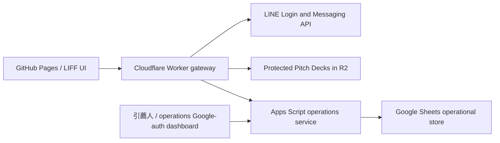

# 致富投資

Mobile-first investment membership, referral attribution, commission ledger, and subscription-operations MVP for 引薦人 plus approved high-net-worth investor referral networks. The local build is a real permissioned workflow with Demo identity and notification adapters; production providers can be enabled through environment variables without moving secrets into browser code.

> Demo content is fictional and is not an offer, solicitation, investment recommendation, or record of real performance.

## Local Docker

```bash
cp .env.example .env
docker compose up --build -d
open http://localhost:4173
```

Verify the running container:

```bash
npm run smoke
docker compose ps
docker compose logs --tail=100 app
```

Stop it without removing persisted Demo data:

```bash
docker compose down
```

To also remove the local data volume and reseed the next boot:

```bash
docker compose down --volumes
```

## Local Node development

```bash
npm install
cp .env.example .env
npm run dev
```

Tests:

```bash
npm test
npm run typecheck:worker
npm run build:worker
npm run test:e2e
```

`npm test` runs the Node API/domain suite, Cloudflare Workers integration suite, Apps Script VM/domain suite, and the cross-runtime operation contract check.

## GitHub Pages preview

The default Pages deployment is intentionally a **read-only interface preview**. It renders fictional public, member, and admin views, but it will not accept booking, activation, subscription, admin, LINE, or file-delivery writes. Run `npm run build:pages` to inspect the generated `dist-pages/` artifact.

When the repository variable `PUBLIC_API_BASE_URL` points to the production Cloudflare Worker, the build injects that public endpoint and disables every Demo write fallback. The full workflow remains available through Docker. Production write paths require the Cloudflare Worker gateway and Apps Script/Sheets adapters described below; secrets and protected member data do not belong in GitHub Pages.

## Demo roles

- Visitor: public educational content and anonymized project teasers.
- Member: use the Demo member action to see only that member's projects, amounts, timeline, bookings, and secure deck access.
- Operations dashboard: use the Demo admin action to operate confirmations, verify member referrers, manage referral partners and immutable commission snapshots, record qualification evidence and per-project access, update the five amount fields, inspect bookings, retry notifications, export CSV, and inspect audit history.

No shared password is embedded in the repository. Demo sign-in calls a local-only endpoint and receives the same signed, HttpOnly session shape used by the LINE provider adapter.

## Provider boundary



The Docker build runs these boundaries in one Node process for local acceptance. Integration modules keep identity, notification, storage, and document delivery replaceable.

## Security rules

- Never commit `.env`, LINE secrets, Cloudflare credentials, Google credentials, real member records, real subscription amounts, or source Pitch Decks.
- LINE Login and Messaging API channels must be owned by the operating entity and created under the same LINE Provider.
- `LINE_OPERATIONS_USER_ID` and `LINE_COMPLIANCE_USER_ID` are optional server-only notification targets. If they are not configured in live mode, internal notifications stay in the operations queue instead of being sent to an unknown recipient.
- Public analytics must never receive names, phone numbers, LINE user IDs, member IDs, subscription amounts, or document identifiers.
- Licensed-partner qualification and acceptance happen outside this MVP. The dashboard records the approver, approval time, and reference evidence; it does not create legal approval on its own.
- Production publication of privacy, risk, AI, membership, and investment language requires review by the licensed partner or counsel.
- Production admin uses the Apps Script HtmlService deployment with Google allowlist plus a separate TOTP gate. Configure at least two administrators; do not point `ADMIN_DASHBOARD_URL` back to the GitHub Pages Demo admin.

## Confirmed scope

See [docs/PRD.md](docs/PRD.md) for the product baseline and acceptance requirements. The immutable attribution and commission rules are in [docs/REFERRAL_COMMISSION_MODEL.md](docs/REFERRAL_COMMISSION_MODEL.md). The credential setup, deployment order, and live acceptance checklist are in [docs/PRODUCTION_DEPLOYMENT.md](docs/PRODUCTION_DEPLOYMENT.md). If a LINE secret or token may have been disclosed, follow [docs/LINE_CREDENTIAL_ROTATION.md](docs/LINE_CREDENTIAL_ROTATION.md) before deployment. Implemented, locally verified, and still-external items are separated in [docs/COMPLETION_AUDIT.md](docs/COMPLETION_AUDIT.md).
