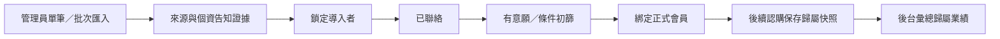

# 潛在投資人、每日摘要與專案媒合模型

## 目的與邊界

本模組把合法取得的潛在投資人名單導入營運後台，保存最初導入者與證據，並在該人完成會員綁定後延續業績歸屬。每日投資摘要整合會員自己的投資進度、已發布內容與可解釋的專案媒合；它不公開招攬、不代替適合度評估，也不構成投資建議。

## 潛在投資人流程

- 單筆與批次匯入都必須保存導入者、來源參考、個資告知／蒐集依據、匯入人與時間。
- 正規化後的手機或 Email 用於重複檢查；系統不因同名就合併兩個人。
- 同一聯絡識別再次匯入時採「最早有證據的有效導入歸屬」；後來的匯入只能補充非歸屬欄位，不能搶走業績。
- 綁定會員時，如果會員已存在不同的 verified 引薦歸屬，系統拒絕自動綁定並要求人工爭議處理，不靜默覆寫。
- 每筆新認購保存獨立的 `acquisitionAttributionSnapshot`；導入者合作狀態日後失效時，該筆與未來認購仍保留歸屬業績，但不因此產生分潤。
- `Attributed Performance` 可彙總 requested／allocated 等營運成果，但不是佣金或應付款。分潤另以建立認購當下仍有效的 `referralSnapshot`、合作協議及人工核准流程決定。
- 會員與公開 API 不回傳導入者、來源證據、分潤或其他潛在投資人資料。

## 投資內容

投資內容分成 `video`、`article`、`project_update`，並保存標題、摘要、專案、外部內容網址、可見範圍、發布狀態、基準日期及風險提示。

- `draft` 不會出現在任何會員或公開 feed。
- `published + publicSafe` 才能出現在公開首頁。
- 非公開的專案更新必須再次套用會員資格與逐案權限，不能只靠知道內容 ID 讀取。
- 影片第一版採已核准的 HTTPS 外部網址；GitHub Pages 不保存上傳檔，受限文件仍走 R2 短效授權。
- 發布、撤回或修改內容都需要管理員理由與 audit event。

## 專案媒合

媒合是 deterministic relevance score，不是黑箱投顧模型。第一版只使用投資人明示偏好與專案結構化資料：

| 訊號 | 作用 |
| --- | --- |
| 產業偏好與 project.industry 一致 | 提高相關性並產生可見理由 |
| ticket range 涵蓋 project.minimumAmountTwd | 提高相關性；超出範圍時明確降分 |
| 會員資格有效且具有逐案權限 | 可顯示受限詳情；否則只回匿名摘要或鎖定提示 |
| project 已發布且仍在有效期間 | 才能進入媒合候選集合 |

分數與理由必須一起回傳。不得以 LINE 群組暱稱、推測財力、性別、年齡、地點或其他敏感屬性推論適合度。會員只看自己的媒合；營運後台可依專案查看候選人，但不把完整名單交給募資方。

## 每日投資摘要

每位會員、每個 Asia/Taipei 日期最多一份摘要，重複執行必須取得同一紀錄或安全更新尚未發送的版本。

摘要包含：

1. 登入後可見的本人五種金額與最新狀態。
2. 當日新發布且該會員可看的影音／文章／專案更新。
3. 最高相關性的專案媒合與可解釋理由。
4. 固定風險聲明與回到安全會員中心的連結。

站內摘要是會員服務的一部分；主動的 LINE／Email 發送則必須有獨立 `dailyDigestConsent`。`marketingConsent` 不得代替摘要同意，摘要同意也不得推定行銷同意。撤回後停止下一次主動發送，不影響必要交易通知。

外部通知一律不放姓名、會員編號或任何認購／入金／分配金額，只提示「今日摘要已更新」並導回登入頁。Email 與 LINE 的 provider 回應、重試與失敗都要記錄；API 回成功或進 queue 不代表真人已收到，正式驗收須以測試收件匣與 LINE 帳號 read-back 證明。

## 驗收案例

1. 無導入者、來源證據或個資告知證據的名單匯入失敗且不寫資料。
2. 同一聯絡識別由第二位導入者再次匯入，不改變第一個有效歸屬。
3. 會員綁定後，新認購快照正確導入者；既有認購不被回填虛構歷史。
4. 導入者業績可按 requested／allocated 分開彙總，且不等於 commission payable。
5. 公開 feed 只出現 published + publicSafe；會員 feed 仍遵守逐案權限。
6. 同一會員同一天重跑摘要不重複建立或重複發送。
7. 未同意、已撤回、未加 LINE 好友或缺 Email 時，不建立對應外部發送工作。
8. 外部摘要訊息不含金額或 PII；登入後的站內摘要只顯示本人資料。
9. 媒合分數具有可讀理由；變更偏好只影響未來結果，不改寫認購歷史。
10. 390px 後台可完成名單匯入預覽、錯誤修正、內容發布與摘要產生，且無水平溢位。
