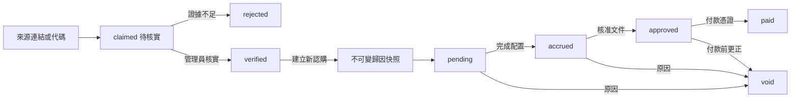

# 引薦歸因與分潤模型

## 目的與邊界

本模組讓雪芬姐及其他經核准的高階人脈合作方都能被記錄為會員的引薦來源，並在認購完成配置後產生可稽核的預估分潤。系統提供營運台帳，不自行認定居間、招攬、投顧或報酬請求權；正式合作契約、適法性、稅務與付款仍由營運法律主體、持牌合作方及專業顧問確認。

MVP 採單一主要引薦人，不做多層、多人拆分、追溯改價或讓引薦人直接查看投資人資料。

## 資料模型

| 紀錄 | 關鍵欄位 | 不變條件 |
| --- | --- | --- |
| Referrer | code、display/legal name、status、default rate bps、basis、agreement reference、effective/expiry | code 唯一且大寫；費率為 0–10,000 個 basis points |
| Member attribution | referrer id/code、claimed/verified/rejected、evidence、claimed/verified actor/time | 來源碼只能建立 claimed；verified 必須有管理員證據 |
| Subscription snapshot | referrer id/name/code、rate、basis、agreement、capturedAt | 建立認購時複製，之後不可被會員或引薦人資料變更覆寫 |
| Commission ledger | state、basis amount、accrued amount、approval/payment evidence、actor/time | approved/paid 不可改費率或快照；paid 不可逆 |

會員與認購保存內部 `memberId` / `subscriptionId`；LINE display name、群組暱稱或 OpenChat 名稱都不是歸因鍵。

## 狀態流程



- 管理員修改會員歸因只影響未來認購；既有認購如需更正，應作廢原分潤紀錄並留下原因，不直接改寫歷史快照。
- `accrued` 是系統依最終配置金額推導的狀態，管理員不能手動輸入。
- `approve` 需要核准參考編號與原因；`pay` 需要付款參考編號與原因；`void` 需要作廢原因。

## 計算規則

MVP 固定以 `allocated_amount` 為基礎，使用整數 basis points 避免浮點誤差：

```text
commissionAccruedAmountTwd = floor(allocatedAmountTwd × commissionRateBps ÷ 10,000)
```

例如最終配置 NT$1,600,000、費率 150 bps（1.5%），預估分潤為 NT$24,000。此金額須在介面標示為「預估／台帳」，完成核准與付款證據後才分別進入 approved 與 paid。

## 權限與隱私

- Visitor/Member：看不到 referrer registry、其他會員歸因、費率或分潤。
- Referrer：MVP 沒有登入後台；不取得會員姓名、LINE user ID、認購或配置金額。
- Operations admin：經 Google allowlist、TOTP 與伺服器端授權後可管理引薦、歸因與分潤。
- Licensed partner/Finance：在外部流程出具核准或付款證據，由 operations 將參考編號寫入台帳。
- CSV、稽核事件與 LINE 訊息遵守資料最小化；LINE 只提示狀態更新，不傳送分潤或投資金額。

## 合規護欄

系統不得把來源碼或分潤機制包裝成公開招攬。臺灣證券交易法對私募對象與一般性廣告／公開勸誘設有限制；金管會私募問答也強調招募行為須限於特定人。涉及證券投資分析或推介時，另受投信投顧法廣告規範。若合作模式屬證券商介紹專業或高資產客戶予私募股權基金，仍須依主管機關命令辦理 KYC、洗錢防制、利益衝突與內控制度，且不得公開招攬。

上線真實合作方前至少完成：法律主體與執照角色確認、逐一合作契約及有效期間、費率／計算基礎／稅務、合格投資人核驗責任、個資告知與保存期限、利益衝突揭露、作廢及爭議處理流程。

參考：

- [證券交易法](https://law.fsc.gov.tw/LawContent.aspx?id=FL007009&kw=12%E5%8D%811&media=print)
- [有價證券私募制度疑義問答](https://www.fsc.gov.tw/fckdowndoc?file=%2F1_3%E6%9C%89%E5%83%B9%E8%AD%89%E5%88%B8%E7%A7%81%E5%8B%9F%E5%88%B6%E5%BA%A6%E7%96%91%E7%BE%A9%E5%95%8F%E7%AD%94-10202.pdf&flag=doc)
- [證券投資信託及顧問法](https://law.fsc.gov.tw/LawContent.aspx?id=FL030633&kw=105-27)
- [證券商得辦理介紹專業投資人及高資產客戶予私募股權基金之令](https://law.fsc.gov.tw/LawContent.aspx?id=GL004132)

## 驗收案例

1. 未知代碼不建立歸因；有效代碼只建立 claimed。
2. 缺 evidence 的管理員核實請求失敗，成功核實由伺服器記錄 actor/time。
3. 認購只快照 verified 且在有效期內的 active referrer。
4. 修改 referrer 費率或會員歸因，不改變既有認購快照與已計算分潤。
5. 最終配置後以整數公式產生 accrued；零配置不產生應計額。
6. 核准、付款、作廢各自驗證必要證據及原因；paid 不可逆。
7. 兩個會員、兩個引薦人與兩個瀏覽器 session 間不得交叉洩漏資料。
8. 390px 手機後台可完成歸因核實、核准與付款，不產生水平溢位。
